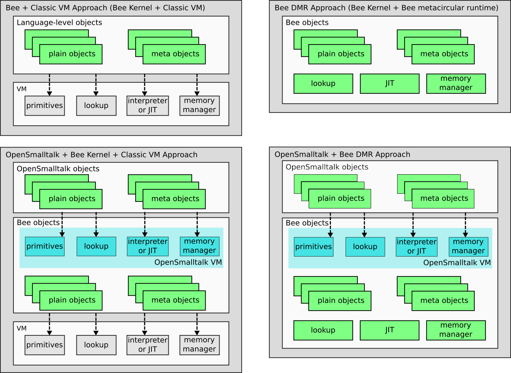

Welcome to Powerlang's documentation!
=====================================

Powerlang is a research vehicle to explore the implementation of programming
laguages. While focused on Smalltalk, it aims to be a generic language creation
toolkit, something you can use to either evolve Smalltalk, or either build
a new language implementation of choice.
We provide tools for coding, bootstrapping, compiling, jitting and debugging the
implementation.

Bee Smalltalk serves as a reference implementation using the framework.
We are implementing an evolution of the classic Smalltalk-80. Something
adapted to the new kinds of systems that are common these days: from
embedded to servers, with or without a gui, supporting remote development
from scratch.

Design
******

Below is our humble vision of what a modern Smalltalk design
should look like, the direction in which we want to go.

We want a minimal modular Smalltalk, that starts from a little kernel and that
can load other modules on-the-fly to grow exactly as needed.
The bootstrap process is done mostly from a specification (source code), using
different dialects (Pharo et al). This allows sealed-system development which
is required when doing big or complex changes, specially in design. Of course,
the live environment development will be supported as usual in Smalltalk-80
systems.
Computation is represented using Smalltalk Expressions (or SExpressions), 
a lower-level representation of abstract syntax trees (ASTs) that is
encoded into byte arrays (called astcodes).

Namespaces are supported from the beginning, and form the base of packages.
Packages are built into (binary) image segments that load very quickly.
A package distribution system computes dependencies and fetches
prebuilt image segments for quick setup, update and deployment.

The base system can be used to allow creation of
different dynamic languages.  In particular, 
we expect Bee Smalltalk to expand on two different axes: on one hand, it can
grow to become a full, tightly integrated Smalltalk; on the other hand,
its kernel can be the base system on top of which we support other
Smalltalks (or other languages). The main candidate for the latter
approach is to make the opensmalltalk-vm run on top of Bee kernel, instead
of translating it to C and compiling. This would make Squeak/Pharo/Cuis
run on top of Bee, which could either run self-hosted (if using the DMR)
or on top of another VM (like the OMR). Below we present a look of different
possible mixes and matches of language environments and hosting runtimes.

Implementation
**************

Powerlang-based systems should work on Windows, Linux, Mac, Android and nopsys, 
including embedded platforms.
64 and 32 bit architectures are the starting point, but if possible we may try
even smaller.

At least two runtimes are being developed in parallel. The pure DMR (dynamic
metacircular runtime), and the `Eclipse OMR <https://www.eclipse.org/omr/>`_.
The DMR is an AOT-based approach, that uses Smalltalk to pre-nativize a Smalltalk
JIT compiler, and then uses that compiler to nativize on the fly other
Smalltalk code. The OMR is a state-of-the-art C++ runtime engine, that includes
plugabble interpreters, JIT-compilers and garbage collectors, which can be
used to support languages like Smalltalk.

Smalltalk source code is stored on git, using a tonel-like format. We store 
just code and definitions in the repo, no artifacts.
Build artifacts go through Continuous Integration from the very beginning.
Each OS platform is put in a separate namespace and built into separate
image segments, which are autoloaded according at startup according to the
running platform.
The system can be debugged remotely through a vdb/gdb connection, which
allows both local and remote debugging.

Setup
*****

To setup the development repository, see the instructions in 
`Powerlang repo <github.com/powerlang/powerlang>`_.

How to improve this documentation
*********************************

This documentation was written in rst format and html output was generated
by sphinx. You will find these same contents
in `/docs` directory. To be able to compile them, you will need to install
sphinx in your system::

    pip3 install sphinx sphinx-autobuild

then just from root powerlang dir do::

    sphinx-autobuild docs docs/_build/html

which will open a local http server at http://127.0.0.1:8000 that recompiles
automatically when files are changed and that lets you browser the docs as
you change them. When you have any change, just open a PR in
`github.com/powerlang <https://github.com/powerlang>`_

Indices and tables
==================

.. toctree::
   :maxdepth: 2
   :includehidden:
   
   bootstrap/index
   dmr/dmr
..   :caption: Contents:

* :ref:`genindex`
* :ref:`modindex`
* :ref:`search`

Things to do (PRs are welcome!)
===============================

.. todolist::

